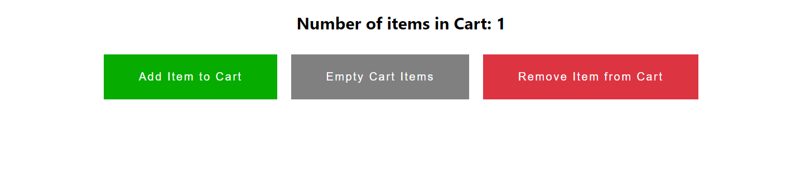

# Basic Redux App [](https://github.com/Aditya-Armal/Basic-Redux-App/actions/workflows/main.yml)

A Basic Redux Application, created with ❤️ by Aditya Armal.

## Live Demo
You can explore the **live demo** of this Todo App by visiting https://basic-redux-app.vercel.app/

## Project Description

This project is a Redux-powered React application that demonstrates efficient state management in React using Redux. It allows users to add and remove items from a cart, with state changes managed centrally in the Redux store. The key advantages of using Redux, such as decluttering components and preventing unnecessary re-renders, are highlighted in this project.The application is developed using React.js, and for state management, we have utilized Redux. This project is beginner-friendly and designed to help you learn the fundamentals of React-Redux.

## What I Learnt/Used

-  : The core library for building the user interface.
-  : Utilized for state management.

## Tools Used

The following tools were used in the development of this project:

- **Code Editor**: [Visual Studio Code (VS Code)](https://code.visualstudio.com/) was used as the code editor.

## Visual Studio Code Extensions

To enhance your development experience, the following Visual Studio Code extensions were used in this project:

- **ES7+ React/Redux/React-Native snippets**: Provides helpful code snippets for React, Redux, and React Native development.
- **ESLint**: A linter that helps maintain code quality and style.
- **GitHub Theme (Default)**: The GitHub-inspired theme for a clean coding interface.
- **Prettier - Code formatter**: Ensures consistent code formatting and style.

## Requirements

Before getting started with this project, you should have:

- Basic knowledge of React.js.
- Basic knowledge of HTML and CSS.

## Usage

1. Clone this repository to your local machine:

```bash
  git clone https://github.com/aditya-armal/Basic-Redux-App.git
```
Navigate to the project directory:

```bash
cd Basic-Redux-App
```
Install the project dependencies:

```bash
npm install
```
Start the development server:

```bash
npm start
```
Open your web browser and visit http://localhost:3000 to access the Application.
